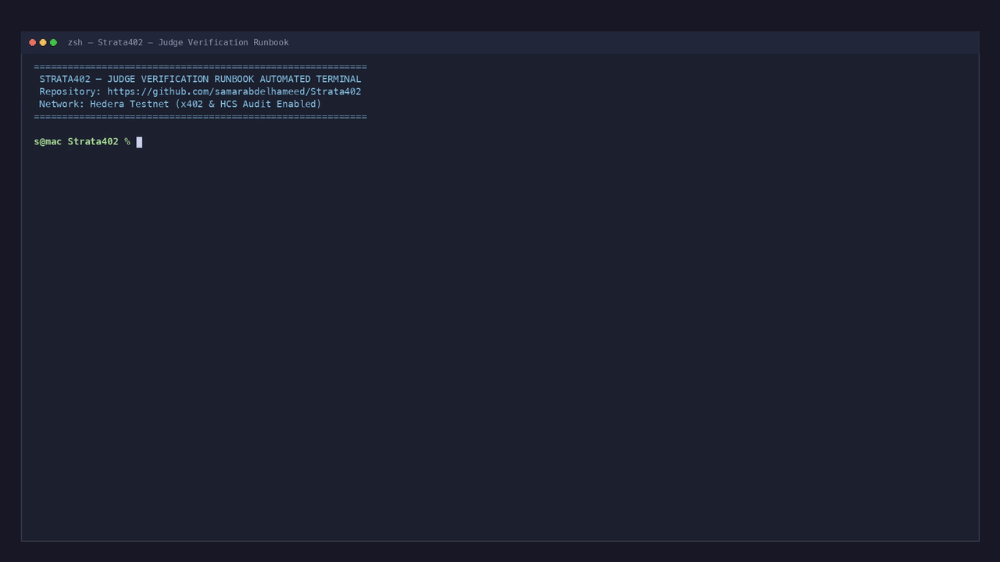
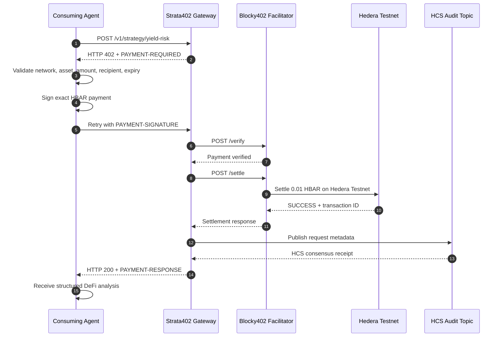

# Strata402

## Autonomous DeFi Intelligence for Machine-to-Machine Payments on Hedera

Strata402 is a pay-per-call DeFi intelligence service for autonomous agents. It exposes a structured analysis endpoint on Hedera Testnet, protects it with **x402 v2**, and settles each request in HBAR through the hosted **Blocky402 Testnet facilitator**.

An independent consuming agent discovers the service, receives an HTTP 402 challenge, validates the payment requirements, signs the exact HBAR payment, submits it for verification and settlement, and retries the request to receive the paid analysis. Selected request metadata is published to Hedera Consensus Service (HCS) for auditability.

> **Core claim:** Strata402 demonstrates a real agent-to-service payment loop on Hedera Testnet. The production paid path uses live Hedera data. Offline tests use isolated mocks and stubs only where deterministic test isolation requires them.

[](https://github.com/samarabdelhameed/Strata402/actions)


## Demo — Automated Terminal Verification Runbook



> **Auto-playing Terminal Runbook:** The animated demo above records all 9 runbook verification phases executed live on Hedera Testnet in sequence. Full 1080p MP4 video available at [`docs/assets/strata402-judge-verification-runbook.mp4`](docs/assets/strata402-judge-verification-runbook.mp4).

## Why Strata402

Autonomous agents need useful services without API keys, subscription accounts, or manual approval for every request. Service providers need payment infrastructure that is native to HTTP and practical for small machine-to-machine transactions.

Strata402 combines a paid intelligence service, an autonomous consuming agent, and an auditable Hedera trail. It separates verified observations from derived metrics and explicitly labels unavailable protocol data instead of fabricating APY, liquidity, or risk claims.

## Hedera Track Alignment

Strata402 targets the **AI & Agentic Payments on Hedera** track.

| Requirement | Implementation | Evidence |
| :--- | :--- | :--- |
| Live x402-gated service | `POST /v1/strategy/yield-risk` protected by x402 v2 | Gateway and live C1 run |
| Blocky402 settlement | `https://api.testnet.blocky402.com` | Hosted facilitator capability check and live settlement |
| Independent consuming agent | `apps/consuming-agent` handles discovery, payment, and retry | CLI implementation and C1 flow |
| Real paid request | `0.01 HBAR` transferred on Hedera Testnet | Transaction `0.0.7162784-1789299896-582181958` |
| Public repository and README | Setup, architecture, API, security, and evidence documented here | This repository |
| Demo video | Automated terminal verification runbook (under 5 mins) | [Recorded Runbook Video](docs/assets/strata402-judge-verification-runbook.gif) |

The qualification-critical path does not depend on optional smart contracts, SaucerSwap execution, Bonzo data, HTS payments, or HCS-14 identity registration.

## Live End-to-End Evidence

| Field | Verified value |
| :--- | :--- |
| Transaction ID | `0.0.7162784-1789299896-582181958` |
| Request ID (`/api/paid` ↔ HCS) | `d0fd0709-08bc-456f-861a-6f8ebc08fb89` |
| Payer | `0.0.10329902` |
| Service account (`payTo`) | `0.0.10464194` |
| Facilitator fee payer | `0.0.7162784` |
| Amount | `1,000,000` tinybars (`0.01 HBAR`) |
| Network | `hedera:testnet` |
| Scheme | `exact` |
| x402 version | `2` |
| Facilitator | `https://api.testnet.blocky402.com` |
| Hedera result | `SUCCESS` |
| Consensus timestamp | `1789299911.969013413` |
| HCS topic | `0.0.10483725` |
| Latest observed HCS sequence | `52` |
| HCS consensus timestamp | `1789299912.217294104` |
| Paid endpoint | `/v1/strategy/yield-risk` |
| Paid response | `HTTP 200` |

Verify the settlement through [Hedera Mirror Node](https://testnet.mirrornode.hedera.com/api/v1/transactions/0.0.7162784-1789299896-582181958) or [HashScan Testnet](https://hashscan.io/testnet/transaction/0.0.7162784-1789299896-582181958).

Verify the audit trail through [Hedera Mirror Node](https://testnet.mirrornode.hedera.com/api/v1/topics/0.0.10483725/messages?limit=1&order=desc) or [HashScan Testnet](https://hashscan.io/testnet/topic/0.0.10483725).

The latest HCS event records the order request identifier, endpoint, and successful response status (`{"requestId":"d0fd0709-08bc-456f-861a-6f8ebc08fb89","endpoint":"/v1/strategy/yield-risk","status":"200",...}`). The observability loop is sealed end-to-end: the `requestId` echoed by `/api/paid` is the exact same UUID inside the HCS message, so the API call and the on-chain audit entry are provably the same request — never a separate event or an arbitrary ID. HCS events do not store private keys, full payment payloads, or full AI transcripts.

Earlier Testnet settlement records include `0.0.9185802-1789162601-197120935`, `0.0.9185802-1789101908-717608026`, `0.0.9185802-1789164101-943032414`, and the web-studio live runs `0.0.7162784-1789299072-132216527` (HCS seq `51`) and `0.0.7162784-1789299896-582181958` (HCS seq `52`).

### Final on-chain proof — Hedera Mirror Node

Live values pulled from `GET https://testnet.mirrornode.hedera.com` (read-only, no new payment):

**Transaction transfers — `0.0.7162784-1789299896-582181958` (`SUCCESS`, consensus `1789299911.969013413`)**

| Account | Amount (tinybars) | Role |
| :--- | ---: | :--- |
| `0.0.7162784` | `-265,670` | Blocky402 signer / fee payer (tx fee) |
| `0.0.10329902` | `-1,000,000` | Buyer (0.01 HBAR) |
| `0.0.10464194` | `+1,000,000` | Service account (payTo) |

**Decoded HCS audit event — Topic `0.0.10483725`, sequence `52`, consensus `1789299912.217294104` (next block after payment)**

```json
{
  "requestId": "d0fd0709-08bc-456f-861a-6f8ebc08fb89",
  "endpoint": "/v1/strategy/yield-risk",
  "status": "200",
  "paymentTxId": null,
  "blockTimestamp": null,
  "at": "2026-09-13T11:45:10.977Z"
}
```

The chain is complete and verifiable in isolation: **`/api/paid` response → same requestId in HCS event → HCS sequence `52` → Mirror Node transaction `SUCCESS`**.

## Payment Flow



The gateway validates the network, asset, amount, recipient, scheme, resource, expiry, and replay state. The consuming agent fails closed if a challenge does not match the service contract.

| Payment field | Value |
| :--- | :--- |
| Network | `hedera:testnet` |
| Asset | `0.0.0` (HBAR) |
| Scheme | `exact` |
| Price | `1,000,000` tinybars per call |
| Service account | `0.0.10464194` |
| Blocky402 fee payer | `0.0.7162784` |

## Architecture

| Layer | Responsibility | Location |
| :--- | :--- | :--- |
| Web application | Real-data dashboard, paid-flow UI, and HCS explorer | `apps/web` |
| Consuming agent | Discovery, challenge validation, signing, settlement retry, and evidence output | `apps/consuming-agent` |
| API gateway | HTTP API, x402 middleware, payment validation, and HCS publishing | `services/api-gateway` |
| AI engine | Deterministic analysis from Mirror Node facts with honest degradation | `services/ai-engine` |
| Shared SDK | Service metadata, request contracts, and shared types | `packages/x402-sdk` |
| Smart contracts | Additive automation infrastructure, not required by the payment path | `contracts` |

### Data integrity model

- Observed facts come from Hedera Mirror Node.
- Derived metrics are calculated deterministically.
- Unavailable protocol data is returned as `unavailable` rather than estimated.
- Optional language narration is disabled by default and is not required for payment.
- Limitations and financial disclaimers are included in the response contract.

## Implemented Components

| Component | Status | Scope |
| :--- | :--- | :--- |
| x402 API Gateway | Shipped | Express gateway with x402 v2 protection |
| Consuming Agent | Shipped | Independent CLI agent with discovery, payment, settlement, and retry |
| Deterministic AI Engine | Shipped | FastAPI service using Mirror Node-backed facts |
| Mirror Node Adapter | Shipped | Hedera Testnet account and activity reads |
| HCS Metadata Logging | Shipped | Metadata-only events on topic `0.0.10483725` |
| SaucerSwap Adapter | Shipped, read-only | Live Testnet token and pool snapshots; APY unavailable |
| Web UI | Shipped | Next.js 14 real-data dashboard |
| AutoSwapLimit | Deployment and bytecode verified | Execution is not part of the paid flow |
| HederaYieldVault | Deployment and bytecode verified | Custody and automation are not claimed |
| AgentRegistryHCS14 | Not currently verified | Full HCS-14 identity registration is not claimed |
| Bonzo Adapter | Deferred | No eligible live Hedera Testnet source is claimed |

## API Reference

### `GET /health`

Free gateway health check.

### `GET /v1/services`

Free service discovery endpoint exposing service name, endpoint, network, asset, scheme, and price.

### `POST /v1/strategy/yield-risk`

Paid account-level analysis endpoint.

```json
{
  "accountId": "0.0.10464194",
  "riskTolerance": "balanced",
  "amountHbar": 1
}
```

The request contract validates the account identifier, risk tolerance, and amount before any Mirror Node read or payment operation. A paid response includes observed facts, derived metrics, freshness, limitations, unavailable data, payment metadata, and a disclaimer.

### Web routes

| Route | Purpose |
| :--- | :--- |
| `GET /api/account?accountId=` | Mirror Node account snapshot |
| `GET /api/hcs?limit=25` | HCS messages with decoded metadata |
| `GET /api/services` | Service and integration status |
| `GET /api/paid` | Paid-flow availability and price |
| `POST /api/paid` | Server-side paid analysis flow |
| `GET /api/payment-proof` | Mirror-verified settlement evidence |

## Quick Start

### Prerequisites

- Bun `>= 1.1` or Node.js `>= 20`
- Python `>= 3.11` for the AI engine
- A funded Hedera Testnet payer account for the live C1 flow

### Install and configure

```bash
bun install
cp .env.example .env
```

For Hedera Testnet:

```env
STRATA402_NETWORK=hedera:testnet
X402_FACILITATOR_URL=https://api.testnet.blocky402.com
HEDERA_SERVICE_ACCOUNT_ID=0.0.10464194
X402_PRICE_TINYBARS=1000000
```

Keep private keys in the local, gitignored `.env` file. Never expose them to the browser or commit them.

### Run the services

```bash
bun run dev:gateway
```

The gateway listens on `http://localhost:8080`.

```bash
cd services/ai-engine
python -m venv .venv
source .venv/bin/activate
pip install -r requirements.txt
uvicorn app.main:app --reload --port 8000
```

```bash
bun run dev:web
```

The web UI listens on `http://localhost:3000`.

### Run the live C1 flow

The following command can spend real **Testnet** HBAR. Run it only for an intentional live test:

```bash
STRATA402_RUN_C1=true STRATA402_C1_CONFIRM=true bun run preflight:c1
```

Verify the resulting transaction through Hedera Mirror Node after the run.

## Testing and Verification

The repository separates offline tests from live-network verification.

```bash
node scripts/validate-workspaces.mjs
./node_modules/.bin/tsc --noEmit
cd apps/web && ../../node_modules/.bin/tsc --noEmit
bun test tests/unit
(cd services/ai-engine && .venv/bin/python3 -m pytest)
```

The latest recorded safe verification reported:

- TypeScript unit tests: **212 passed, 0 failed** (6 live-network tests skipped intentionally).
- Python tests: **26 passed, 0 failed**.
- TypeScript typecheck (root + web): **passed**.
- Next.js production build: **passed**.
- No transaction, signature, or facilitator settlement call was made during offline verification.

Some unit and state-machine tests intentionally use mocks or stubs. They verify validation and control-flow behavior; they are not evidence of a live payment.

## Security and Failure Behavior

Strata402 is designed to fail closed at payment boundaries.

- Payment requirements must match Hedera Testnet.
- The current payment asset is HBAR (`0.0.0`).
- The amount must match the issued requirement in tinybars.
- The recipient must match the configured service account.
- Unsupported schemes and malformed payloads are rejected.
- Expired and replayed payments are rejected.
- Private keys remain server-side.
- HCS events contain metadata only.
- External-data failures degrade to explicit unavailable states rather than fabricated values.

## What Strata402 Does Not Claim

The current submission does **not** claim:

- SaucerSwap swap, LP, or yield execution.
- Bonzo live Testnet yield data.
- Live pool APY or fee-history data.
- HTS-token settlement or custom fee schedules.
- A2A or ACP multi-agent negotiation.
- Recurring or streamed payments using Scheduled Transactions.
- Fully verified HCS-14 identity registration.
- Autonomous fund custody, production trading, guaranteed returns, or financial advice.

## Repository Structure

```text
strata402/
├── apps/consuming-agent/       # Independent x402 payer agent
├── apps/web/                   # Next.js real-data dashboard
├── contracts/                  # Hardhat and Foundry Solidity workspace
├── packages/x402-sdk/          # Shared service and request contracts
├── services/api-gateway/       # Express gateway and x402 resource server
├── services/ai-engine/         # FastAPI deterministic analysis engine
├── tests/                      # Unit and integration tests
├── docs/                       # Acceptance and verification documentation
├── .env.example
└── package.json
```

## Roadmap

| Planned capability | Status |
| :--- | :--- |
| HCS-14 agent registration | Future work; not claimed as verified |
| HTS payment assets | Future work |
| Dynamic pricing | Future work; current pricing is fixed per call |
| SaucerSwap execution | Future work; current adapter is read-only |
| Qualified Bonzo Testnet source | Future work, gated by source eligibility |
| Scheduled or streamed payments | Future work |

## License

MIT

## References

[1]: https://x402.org "x402 Protocol"
[2]: https://api.testnet.blocky402.com/supported "Blocky402 Hosted Testnet Supported Networks"
[3]: https://blocky402.com/docs/api-reference/ "Blocky402 API Reference"
[4]: https://docs.hedera.com/ "Hedera Developer Documentation"
[5]: https://testnet.mirrornode.hedera.com/ "Hedera Testnet Mirror Node"
[6]: https://test-api.saucerswap.finance/ "SaucerSwap Testnet API"
[7]: https://github.com/samarabdelhameed/Strata402 "Strata402 GitHub Repository"

For the detailed verification record, see [`AUDIT.md`](./AUDIT.md) when included in the repository. Add the final demo-video URL before submitting.

<!-- References: [1] [2] [3] [4] [5] [6] [7] -->

<!-- End of README -->
