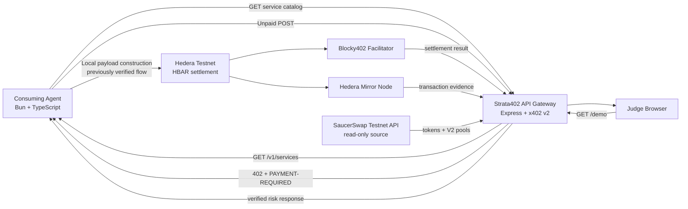

# Strata402 — Technical Demo Script

## Purpose

This script presents Strata402 as a real, verifiable x402-powered DeFi intelligence service on Hedera Testnet. It is designed for a **4–5 minute judging video** and uses only live read-only checks during the recording. The previously settled payment is shown as historical proof and is not repeated during the demo.

> **Safety rule:** Do not run the C1 paid-request command during recording. The commands below perform health, catalog, unpaid-402, payment-proof, and SaucerSwap read-only checks only.

## 1. Opening statement — 0:00–0:30

> “Strata402 is an autonomous DeFi intelligence service built on Hedera. Its core capability is machine-to-machine access to paid intelligence: an agent discovers a service, receives a real x402 payment challenge, pays in HBAR, and verifies settlement on-chain before trusting the response.
>
> “This is not a simulated payment flow. The project has already completed a real Hedera Testnet settlement for 1,000,000 tinybars, equal to 0.01 HBAR. The transaction is independently verified through the Hedera Mirror Node. During this demonstration, I will run only read-only checks so the audience can verify the service without creating another payment.”

## 2. Technical architecture flowchart — 0:30–0:55



### Spoken explanation

> “The consuming agent is a Bun and TypeScript client. The Express gateway is protected by x402 v2. The unpaid request returns a real 402 challenge. In the completed payment proof, the agent constructed and signed the Hedera payment locally, Blocky402 facilitated settlement, and the Mirror Node provided independent transaction evidence. The current demo also probes SaucerSwap’s public Testnet data read-only. The browser never receives private keys and does not send a payment during this recording.”

## 3. Terminal preparation — 0:55–1:20

Use two terminal windows. In the first terminal, start the gateway from the current project checkout.

```bash
cd /Users/s/hack2027/Strata402

git switch main
git pull --ff-only origin main
printf 'HEAD: '; git rev-parse --short HEAD
printf 'BRANCH: '; git branch --show-current
git status --short --branch

set -a
source .env
set +a

bun run dev
```

Expected evidence:

```text
branch: main
working tree: clean, except intentionally untracked local documents if present
Gateway listening on :8080
network: hedera:testnet
```

Do not show `.env` contents on screen. Do not paste private keys, headers, or raw payloads into the recording.

## 4. Read-only Gateway verification — 1:20–2:05

Open a second terminal and run the following commands one at a time.

### 4.1 Health

```bash
curl -sS -i http://127.0.0.1:8080/health
```

Say:

> “The gateway is live and identifies the Hedera Testnet environment.”

Confirm:

```text
HTTP 200
network = hedera:testnet
x402Version = 2
```

### 4.2 Service discovery

```bash
curl -sS http://127.0.0.1:8080/v1/services | python3 -m json.tool
```

Point out the values returned by the live catalog:

```text
service: yield-risk
priceTinybars: 1000000
asset: 0.0.0
network: hedera:testnet
payTo: 0.0.10464194
```

Say:

> “These values come from the running gateway response. They are not copied into the presentation as live metrics.”

### 4.3 Real unpaid x402 challenge

```bash
curl -sS -i \
  -X POST http://127.0.0.1:8080/v1/strategy/yield-risk \
  -H 'content-type: application/json' \
  --data '{}'
```

Point out:

```text
HTTP/1.1 402 Payment Required
PAYMENT-REQUIRED: present
```

Say:

> “The gateway refuses an unpaid request and returns a real x402 v2 challenge. This command sends no PAYMENT-SIGNATURE, creates no Hedera transaction, and spends no HBAR.”

## 5. Live verification of the historical payment proof — 2:05–2:45

Run:

```bash
curl -sS http://127.0.0.1:8080/v1/payment-proof | python3 -m json.tool
```

Point out only the public evidence fields:

```text
status: verified
transactionId: 0.0.9185802-1789101908-717608026
payer: 0.0.10329902
payTo: 0.0.10464194
amountTinybars: 1000000
```

Say:

> “This endpoint performs a server-side, keyless read of the Hedera Mirror Node. It verifies the historical transaction status and transfer amounts before returning ‘verified’. It does not send a new payment.”

Open the public HashScan link in a browser:

```text
https://hashscan.io/testnet/transaction/0.0.9185802-1789101908-717608026
```

Say:

> “This is public ledger evidence. The transaction is a previous Testnet proof, not a new transaction created by opening this page.”

## 6. Demo page — 2:45–3:25

Open:

```text
http://127.0.0.1:8080/demo
```

Show the following sections:

| Section | What to demonstrate | Truthful interpretation |
|---|---|---|
| Live Gateway Check | service, network, price, payTo | Read from the live gateway |
| Validation read-only | 402 challenge | No payment signature is sent |
| Previously Verified Payment Proof | verified status and transaction link | Historical proof re-checked through Mirror Node |
| Protocol data status | APY unavailable | No APY is fabricated |
| Bonzo status | deferred | No eligible live Testnet source was claimed |
| SaucerSwap status | live source only if the current build displays it | Read-only data, not a swap or yield guarantee |

Say:

> “The interface separates a current live gateway check from a previously verified payment. This prevents the demo from presenting old settlement evidence as if a new payment happened now.”

## 7. SaucerSwap read-only live probe — 3:25–4:05

If SaucerSwap is being shown in the current build, run these commands separately. They do not require a key according to the team’s current email response, but the public documentation may still mention authentication. The live response is the authority for this probe.

```bash
curl -sS --max-time 15 \
  https://test-api.saucerswap.finance/tokens \
  -o /tmp/strata402-saucerswap-tokens.json \
  -w 'tokens_http=%{http_code} content_type=%{content_type} bytes=%{size_download}\\n'

curl -sS --max-time 20 \
  https://test-api.saucerswap.finance/v2/pools/full \
  -o /tmp/strata402-saucerswap-pools.json \
  -w 'pools_http=%{http_code} content_type=%{content_type} bytes=%{size_download}\\n'

python3 - <<'PY'
import json
from pathlib import Path

tokens = json.loads(Path('/tmp/strata402-saucerswap-tokens.json').read_text())
pools = json.loads(Path('/tmp/strata402-saucerswap-pools.json').read_text())

assert isinstance(tokens, list) and tokens, 'tokens response is not a non-empty array'
assert isinstance(pools, list) and pools, 'pools response is not a non-empty array'

required_pool = {
    'id', 'contractId', 'tokenA', 'tokenB', 'amountA', 'amountB',
    'fee', 'sqrtRatioX96', 'tickCurrent', 'liquidity'
}
required_token = {
    'id', 'name', 'symbol', 'decimals', 'price', 'priceUsd'
}

for pool in pools:
    missing_pool = required_pool - pool.keys()
    assert not missing_pool, f'pool schema missing: {sorted(missing_pool)}'
    for side in ('tokenA', 'tokenB'):
        missing_token = required_token - pool[side].keys()
        assert not missing_token, f'{side} schema missing: {sorted(missing_token)}'

print(f'tokens_count={len(tokens)}')
print(f'pools_count={len(pools)}')
print('schema_validation=PASS')
print('read_only=TRUE')
print('network_guard=TESTNET_ENDPOINT')
print('apy=UNAVAILABLE unless separately evidenced')
PY
```

Say:

> “SaucerSwap data is read-only market infrastructure data. It provides token and pool fields, but this response does not provide enough information to claim APY. Therefore APY remains unavailable unless a separate, validated methodology is implemented.”

Do not display the entire JSON response. Display counts, schema validation, source URL, and timestamp only.

## 8. Closing statement — 4:05–4:40

> “The completed proof is an end-to-end economic and technical flow: service discovery, a real x402 challenge, Hedera HBAR payment, facilitator settlement, and independent Mirror Node verification. The browser demo exposes the evidence without exposing secrets. Where the project does not have an eligible live source, it says unavailable or deferred instead of inventing numbers. SaucerSwap Testnet data is now independently reachable in read-only mode, while APY remains unavailable because the live response does not include the volume or fee-history data required for a defensible yield calculation.”

> “Strata402 is therefore presented as a verifiable Hedera x402 DeFi intelligence MVP, not as a fictional full-protocol dashboard.”

## 9. Final acceptance checklist

| Check | Expected result |
|---|---|
| Git checkout | `main`, current approved commit |
| Gateway health | HTTP 200 |
| Service catalog | HTTP 200 with live network, amount, and payTo |
| Unpaid strategy request | HTTP 402 with `PAYMENT-REQUIRED` |
| Payment proof | `status: verified` from live Mirror verification |
| Demo page | HTTP 200 and live values load in browser |
| SaucerSwap tokens | HTTP 200, non-empty JSON array |
| SaucerSwap pools | HTTP 200, non-empty JSON array |
| SaucerSwap schema | PASS |
| APY | `UNAVAILABLE` unless separately proven |
| PAYMENT-SIGNATURE during recording | NO |
| New Hedera transaction during recording | NO |
| HBAR spent during recording | 0 |
| Mock data | NONE |
| Secrets shown or committed | NONE |

## 10. What not to claim

Do not claim that Strata402 currently ships Bonzo integration, SaucerSwap swaps, HCS audit, automated strategy execution, smart-contract limit orders, or a live APY calculation unless each has a separate real source and successful acceptance test. The strongest claim supported by the current evidence is:

> **Strata402 is a real, verifiable x402 payment-and-intelligence MVP on Hedera Testnet, with live Mirror Node proof and read-only SaucerSwap Testnet data discovery.**

## References

[1]: https://docs.saucerswap.finance/api-reference/rest/pools-v2/list-v2-pools-full "SaucerSwap REST API: List V2 pools"
[2]: https://docs.saucerswap.finance/developers/contracts "SaucerSwap canonical contract deployments"
[3]: https://hashscan.io/testnet/transaction/0.0.9185802-1789101908-717608026 "Strata402 verified Hedera Testnet transaction"
[4]: https://docs.hedera.com/ "Hedera documentation"
[5]: https://x402.org/ "x402 protocol website"
